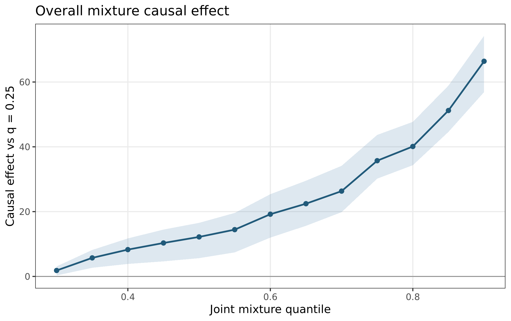
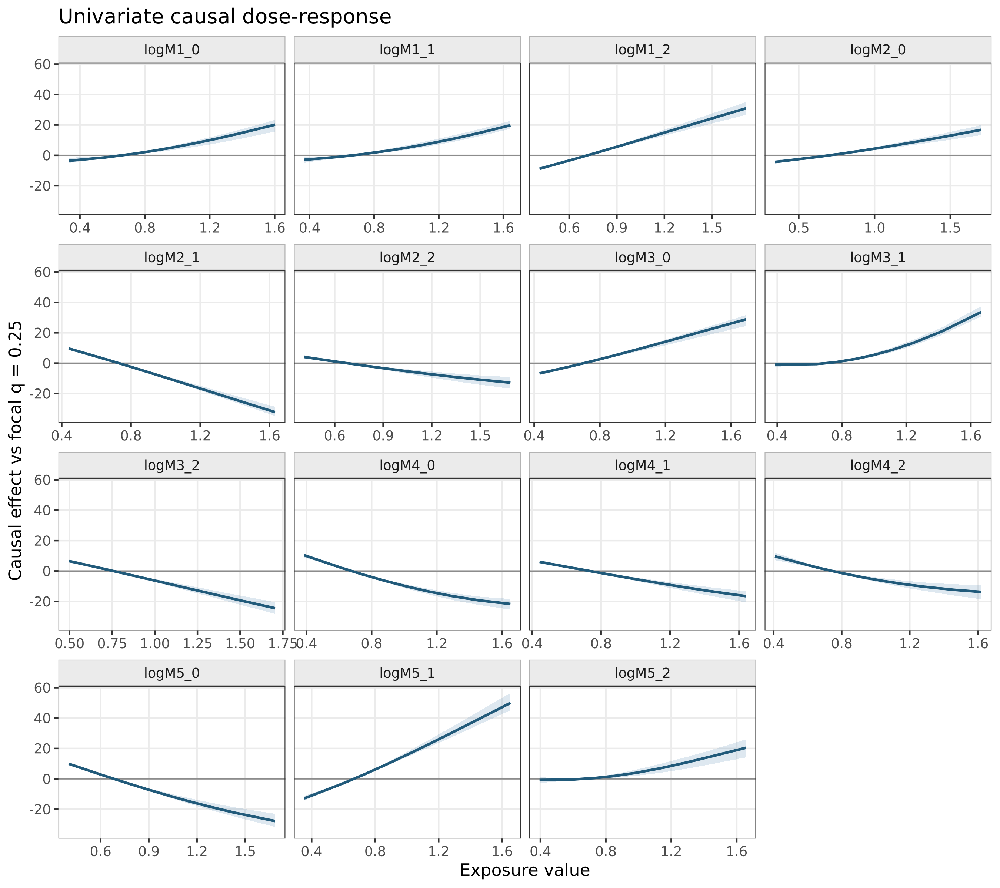
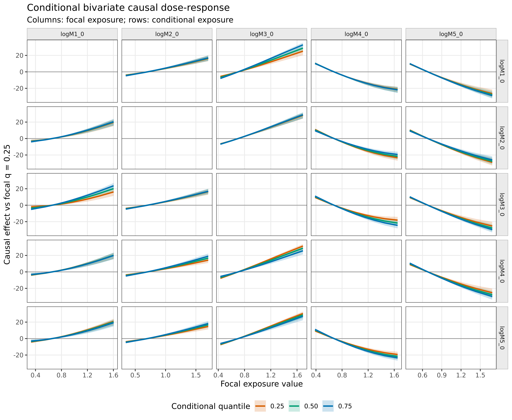
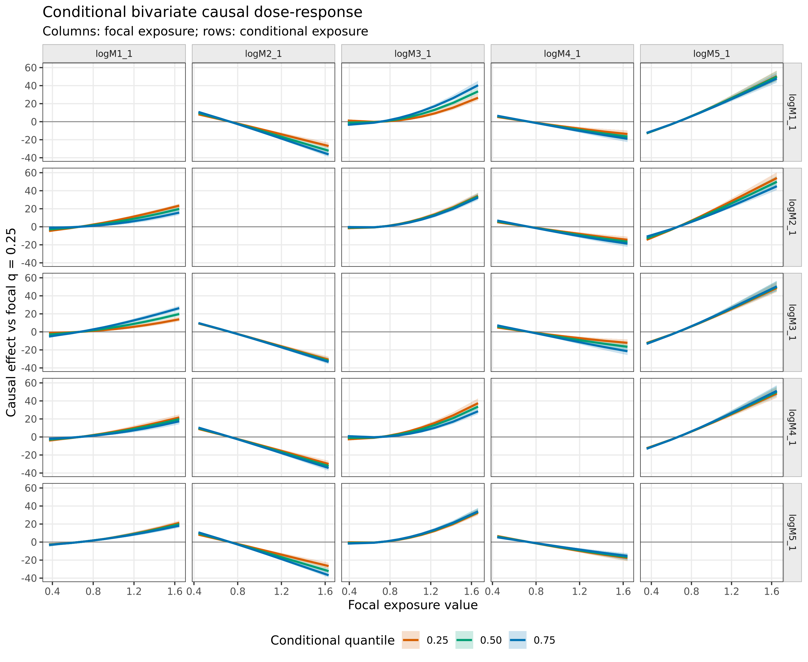
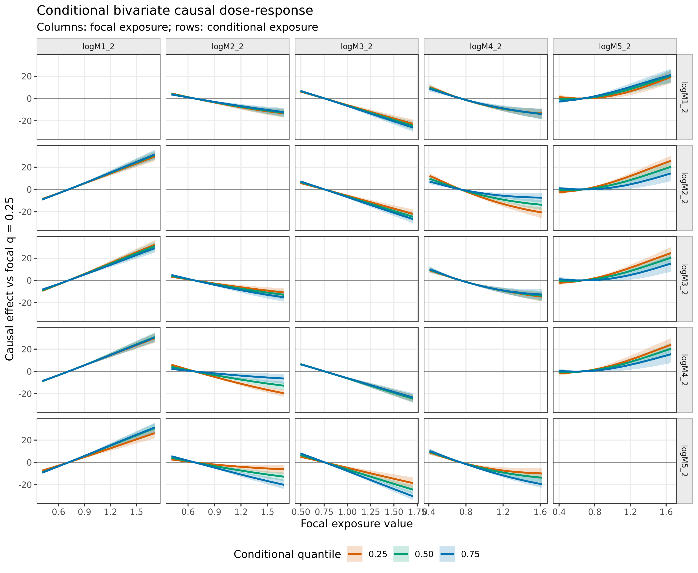
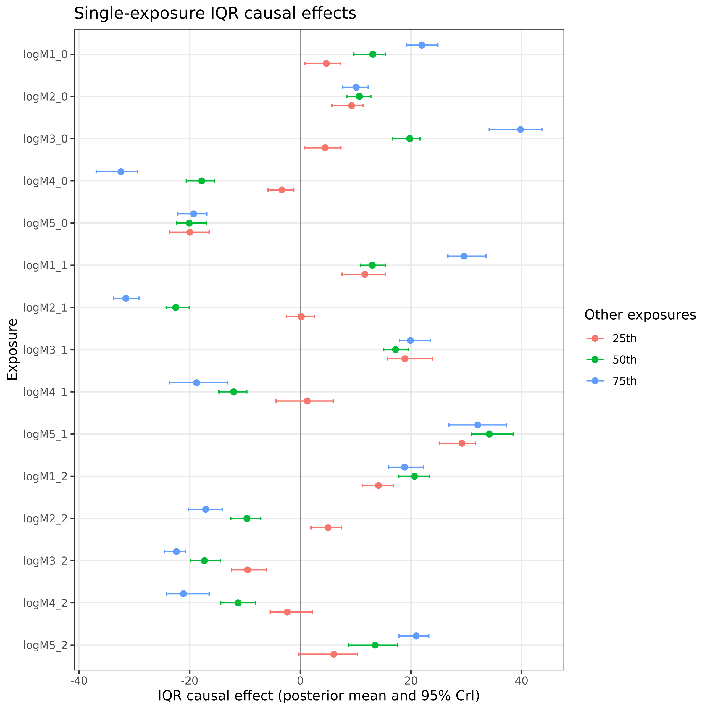
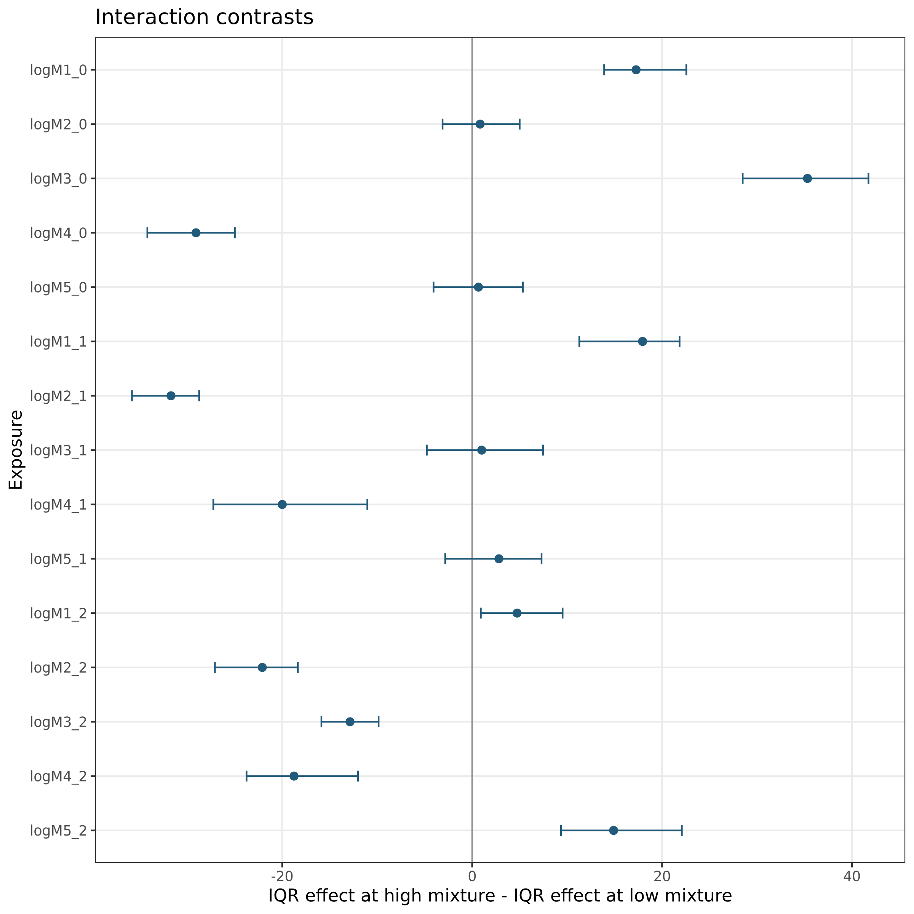

```{r setup, include = FALSE, purl=FALSE}
knitr::opts_chunk$set(
  collapse = TRUE,
  comment = "#>",
  eval = FALSE,
  purl = FALSE,
  fig.align = "center"
)
```

## What These Plots Estimate

The causal plotting commands use the fitted g-BKMR models to repeat the full
g-computation algorithm under each requested exposure intervention. For every
posterior draw, the algorithm generates each time-dependent confounder in time
order under the intervention history and then predicts the outcome. The plotted
contrasts therefore include exposure effects transmitted through the modeled
time-dependent confounder process.

This differs from functions such as
`bkmr::PredictorResponseUnivar(fit$raw_results$fit_y)`. Those functions describe
the fitted outcome regression surface `h(Z)` while holding its predictors at
chosen values. They are useful model summaries, but they do not regenerate and
marginalize the time-dependent confounders under an exposure intervention.

The first plotting API follows the usual BKMR fixed-background convention:
exposures that are not being varied are fixed at their marginal median unless a
different background quantile is requested. Baseline covariates remain fixed at
the values used by the fitted g-computation, currently their sample means.

## Fit the Model

All five commands take the object returned by `gbkmr_run()`.
The figures below use one deterministic simulated longitudinal dataset with five
metals at three visits, one continuous time-dependent confounder measured after
the first and second visits, and two baseline covariates. They illustrate the
plotting interface and are not SHS results. The complete data-generation and
figure script is available in
[`tools/generate-causal-plot-examples.R`](https://github.com/Lyric98/CausalBKMR/blob/master/tools/generate-causal-plot-examples.R).

The short MCMC and Monte Carlo settings below keep the example reproducible on
a laptop. Substantive analyses should use longer chains, inspect diagnostics,
and increase `K` until the g-computation summaries are stable.

```{r fit, purl=FALSE}
library(causalBKMR)

plot_sel <- seq(1200, 2000, by = 40)
fit <- gbkmr_run(
  data = prepared,
  outcome = "Y",
  outcome_type = "continuous",
  time_points = 3,
  currind = 2026,
  sel = plot_sel,
  K = 15,
  iter = 2000,
  n_knots = 40,
  engine = "bkmr",
  verbose = FALSE
)
```

Every command returns the same core elements:

- `summary`: posterior estimates and credible intervals in tidy form.
- `draws`: draw-level counterfactual means or causal contrasts.
- `interventions`: the exact exposure matrix evaluated by g-computation.
- `plot`: a ready-to-display `ggplot` object.
- `estimand` and `settings`: a textual estimand and the numerical settings used.

```{r result-contract, purl=FALSE}
result$summary
result$draws
result$interventions
result$plot
result$estimand
```

## Overall Mixture Causal Effect

`gbkmr_causal_overall()` jointly sets every exposure component to each requested
quantile. By default, the reference intervention sets every component to its
25th percentile. At joint quantile `q`, the plotted estimand is

\[
E\{Y(A=q)\} - E\{Y(A=0.25)\}.
\]

Each counterfactual mean integrates over the sequentially generated
time-dependent confounders.

```{r overall, purl=FALSE}
overall <- gbkmr_causal_overall(
  fit,
  quantiles = seq(0.30, 0.90, by = 0.05),
  reference = 0.25,
  K = 5,
  sel = plot_sel,
  seed = 2026
)

overall$summary
overall$plot
```

```{r overall-figure, echo=FALSE, eval=TRUE, out.width="88%", fig.alt="Overall mixture causal-effect curve with a posterior credible band."}

```

## Univariate Causal Dose-Response

`gbkmr_causal_univariate()` varies one exposure column at a time and fixes all
other exposure columns at the median by default. Within a focal exposure `j`,
the curve is

\[
E\{Y(A_j=x, A_{-j}=0.50)\}
- E\{Y(A_j=q_{0.25,j}, A_{-j}=0.50)\}.
\]

The horizontal axis uses the observed exposure scale, while `quantile` remains
available in the returned data.

```{r univariate, purl=FALSE}
univariate <- gbkmr_causal_univariate(
  fit,
  quantiles = seq(0.10, 0.90, by = 0.10),
  reference = 0.25,
  background = 0.50,
  K = 5,
  sel = plot_sel,
  seed = 2026
)

univariate$summary
univariate$plot
```

```{r univariate-figure, echo=FALSE, eval=TRUE, out.width="100%", fig.alt="Fifteen univariate causal dose-response panels with posterior credible bands."}

```

Use `time_points` to select visits without listing every exposure name. Visit
indices match the exposure-name suffixes and begin at zero.

```{r univariate-filter, purl=FALSE}
baseline_visit <- gbkmr_causal_univariate(
  fit,
  time_points = 0,
  quantiles = seq(0.20, 0.80, by = 0.10)
)
```

## Conditional Bivariate Causal Dose-Response

`gbkmr_causal_bivariate()` varies a focal exposure while fixing a second
exposure at low, middle, and high levels. The remaining exposures are fixed at
the median. For every conditional level `c`, the curve is contrasted with the
focal exposure's 25th percentile under that same `c`:

\[
E\{Y(A_j=x, A_k=c, A_{-(j,k)}=0.50)\}
- E\{Y(A_j=q_{0.25,j}, A_k=c, A_{-(j,k)}=0.50)\}.
\]

The direction of each pair matters: the focal exposure is on the horizontal axis,
and the conditional exposure defines the colored levels.

The matrix layout places focal exposures in columns and conditioning exposures
in rows. Both pair directions are shown, the diagonal is blank, and colors
represent conditioning quantiles 0.25, 0.50, and 0.75. The example creates one
5-by-5 matrix for each visit; the other 13 exposure-by-visit components remain
at their medians in every off-diagonal panel. Lines are posterior mean causal
effects and shaded ribbons are pointwise 95% posterior credible intervals. To
make the conditioning contrasts visible, the illustrative outcome model combines
a signed linear mixture score with its squared term, inducing nonzero pairwise
interactions among all five metals at each visit.

```{r bivariate, purl=FALSE}
time_indices <- 0:2
bivariate <- lapply(time_indices, function(time_index) {
  gbkmr_causal_bivariate(
    fit,
    time_points = time_index,
    layout = "matrix",
    quantiles = seq(0.10, 0.90, by = 0.10),
    conditional_quantiles = c(0.25, 0.50, 0.75),
    reference = 0.25,
    background = 0.50,
    K = 5,
    sel = plot_sel,
    seed = 2026
  )
})
names(bivariate) <- paste("Visit", seq_along(bivariate))

bivariate[["Visit 1"]]$summary
bivariate[["Visit 1"]]$plot
```

### Visit 1

```{r bivariate-visit1-figure, echo=FALSE, eval=TRUE, out.width="100%", fig.alt="Visit 1 five-by-five conditional bivariate causal dose-response matrix. Columns are focal metals, rows are conditioning metals, and the diagonal is blank. Lines are posterior means and ribbons are 95% posterior credible intervals."}

```

### Visit 2

```{r bivariate-visit2-figure, echo=FALSE, eval=TRUE, out.width="100%", fig.alt="Visit 2 five-by-five conditional bivariate causal dose-response matrix. Columns are focal metals, rows are conditioning metals, and the diagonal is blank. Lines are posterior means and ribbons are 95% posterior credible intervals."}

```

### Visit 3

```{r bivariate-visit3-figure, echo=FALSE, eval=TRUE, out.width="100%", fig.alt="Visit 3 five-by-five conditional bivariate causal dose-response matrix. Columns are focal metals, rows are conditioning metals, and the diagonal is blank. Lines are posterior means and ribbons are 95% posterior credible intervals."}

```

With `layout = "matrix"` and `pairs = NULL`, all ordered pairs among the
selected exposures are used. Set `layout = "wrap"` for one panel per unordered
pair, or provide `pairs` explicitly to restrict the causal comparisons.
Filtering by `time_points` keeps large longitudinal mixtures readable and
limits the g-computation grid.

## Single-Exposure IQR Causal Effects

`gbkmr_causal_iqr()` estimates the effect of changing one focal exposure from
its 25th to its 75th percentile. All other exposures are jointly fixed at their
25th, 50th, or 75th percentiles. For focal exposure `j` and background `b`, the
estimand is

\[
E\{Y(A_j=q_{0.75,j}, A_{-j}=b)\}
- E\{Y(A_j=q_{0.25,j}, A_{-j}=b)\}.
\]

Color represents the background mixture level, not visit. Points are posterior
means and intervals are posterior credible intervals.

```{r iqr, purl=FALSE}
iqr_effects <- gbkmr_causal_iqr(
  fit,
  contrast_quantiles = c(0.25, 0.75),
  background_quantiles = c(0.25, 0.50, 0.75),
  K = 5,
  sel = plot_sel,
  seed = 2026
)

iqr_effects$summary
iqr_effects$plot
```

```{r iqr-figure, echo=FALSE, eval=TRUE, out.width="88%", fig.alt="Forest plot of exposure-specific IQR causal effects under three mixture backgrounds."}

```

## High-Versus-Low Interaction Contrasts

`gbkmr_causal_interaction()` subtracts the focal IQR effect under a low
background mixture from the focal IQR effect under a high background mixture.
The subtraction is performed within every posterior draw before calculating
the posterior mean and credible interval:

\[
\left[E\{Y(q_{0.75,j}, A_{-j}=0.75)\}
- E\{Y(q_{0.25,j}, A_{-j}=0.75)\}\right]
-
\left[E\{Y(q_{0.75,j}, A_{-j}=0.25)\}
- E\{Y(q_{0.25,j}, A_{-j}=0.25)\}\right].
\]

A credible interval that excludes zero is evidence, under the fitted model and
causal assumptions, that the focal IQR effect differs between the high and low
mixture backgrounds. It is not a generic test of every possible interaction.

```{r interaction, purl=FALSE}
interactions <- gbkmr_causal_interaction(
  fit,
  contrast_quantiles = c(0.25, 0.75),
  low_background = 0.25,
  high_background = 0.75,
  K = 5,
  sel = plot_sel,
  seed = 2026
)

interactions$summary
interactions$draws
interactions$plot
```

```{r interaction-figure, echo=FALSE, eval=TRUE, out.width="88%", fig.alt="Forest plot of high-versus-low background interaction contrasts."}

```

## Computation and Reproducibility

The commands use `K`, `sel`, and the saved fitted models. Leaving `K = NULL`
and `sel = NULL` reuses the values from `gbkmr_run()`. A smaller `K` is useful
for checking plot layout, but final results should use enough Monte Carlo
trajectories to make the estimates stable.

```{r plot-check, purl=FALSE}
quick_check <- gbkmr_causal_bivariate(
  fit,
  pairs = data.frame(focal = "logM1_0", conditional = "logM2_0"),
  layout = "wrap",
  quantiles = c(0.25, 0.50, 0.75),
  K = 50,
  seed = 2026
)
```

Use the same `seed`, `K`, and `sel` to reproduce a plotting result. The returned
`interventions` table records the exact exposure values used for every regime.
