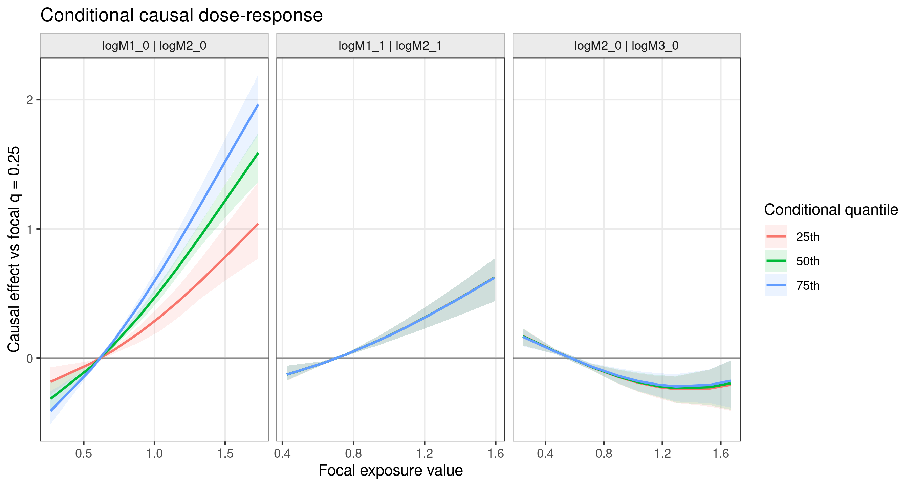

```{r setup, include = FALSE, purl=FALSE}
knitr::opts_chunk$set(
  collapse = TRUE,
  comment = "#>",
  eval = FALSE,
  purl = FALSE,
  fig.align = "center"
)
```

## What These Plots Estimate

The causal plotting commands use the fitted g-BKMR models to repeat the full
g-computation algorithm under each requested exposure intervention. For every
posterior draw, the algorithm generates each time-dependent confounder in time
order under the intervention history and then predicts the outcome. The plotted
contrasts therefore include exposure effects transmitted through the modeled
time-dependent confounder process.

This differs from functions such as
`bkmr::PredictorResponseUnivar(fit$raw_results$fit_y)`. Those functions describe
the fitted outcome regression surface `h(Z)` while holding its predictors at
chosen values. They are useful model summaries, but they do not regenerate and
marginalize the time-dependent confounders under an exposure intervention.

The first plotting API follows the usual BKMR fixed-background convention:
exposures that are not being varied are fixed at their marginal median unless a
different background quantile is requested. Baseline covariates remain fixed at
the values used by the fitted g-computation, currently their sample means.

## Fit the Model

All five commands take the object returned by `gbkmr_run()`.
The figures below use a deterministic simulated longitudinal dataset with three
mixture components at two visits, one continuous time-dependent confounder, and
two baseline covariates. They illustrate the plotting interface and are not SHS
results. The complete data-generation and figure script is available in
[`tools/generate-causal-plot-examples.R`](https://github.com/Lyric98/CausalBKMR/blob/master/tools/generate-causal-plot-examples.R).

The short MCMC and Monte Carlo settings below keep the example reproducible on
a laptop. Substantive analyses should use longer chains, inspect diagnostics,
and increase `K` until the g-computation summaries are stable.

```{r fit, purl=FALSE}
library(causalBKMR)

plot_sel <- seq(720, 1200, by = 16)
fit <- gbkmr_run(
  data = prepared,
  outcome = "Y",
  outcome_type = "continuous",
  time_points = 2,
  currind = 2026,
  sel = plot_sel,
  K = 25,
  iter = 1200,
  n_knots = 25,
  engine = "bkmr",
  verbose = FALSE
)
```

Every command returns the same core elements:

- `summary`: posterior estimates and credible intervals in tidy form.
- `draws`: draw-level counterfactual means or causal contrasts.
- `interventions`: the exact exposure matrix evaluated by g-computation.
- `plot`: a ready-to-display `ggplot` object.
- `estimand` and `settings`: a textual estimand and the numerical settings used.

```{r result-contract, purl=FALSE}
result$summary
result$draws
result$interventions
result$plot
result$estimand
```

## Overall Mixture Causal Effect

`gbkmr_causal_overall()` jointly sets every exposure component to each requested
quantile. By default, the reference intervention sets every component to its
25th percentile. At joint quantile `q`, the plotted estimand is

\[
E\{Y(A=q)\} - E\{Y(A=0.25)\}.
\]

Each counterfactual mean integrates over the sequentially generated
time-dependent confounders.

```{r overall, purl=FALSE}
overall <- gbkmr_causal_overall(
  fit,
  quantiles = seq(0.30, 0.90, by = 0.05),
  reference = 0.25,
  K = 10,
  sel = plot_sel,
  seed = 2026
)

overall$summary
overall$plot
```

```{r overall-figure, echo=FALSE, eval=TRUE, out.width="88%", fig.alt="Overall mixture causal-effect curve with a posterior credible band."}
knitr::include_graphics("figures/causal-overall.png")
```

## Univariate Causal Dose-Response

`gbkmr_causal_univariate()` varies one exposure column at a time and fixes all
other exposure columns at the median by default. Within a focal exposure `j`,
the curve is

\[
E\{Y(A_j=x, A_{-j}=0.50)\}
- E\{Y(A_j=q_{0.25,j}, A_{-j}=0.50)\}.
\]

The horizontal axis uses the observed exposure scale, while `quantile` remains
available in the returned data.

```{r univariate, purl=FALSE}
univariate <- gbkmr_causal_univariate(
  fit,
  exposures = c("logM1_0", "logM2_0", "logM1_1", "logM2_1"),
  quantiles = seq(0.10, 0.90, by = 0.10),
  reference = 0.25,
  background = 0.50,
  K = 10,
  sel = plot_sel,
  seed = 2026
)

univariate$summary
univariate$plot
```

```{r univariate-figure, echo=FALSE, eval=TRUE, out.width="100%", fig.alt="Four univariate causal dose-response panels with posterior credible bands."}
knitr::include_graphics("figures/causal-univariate.png")
```

Use `time_points` to select visits without listing every exposure name.

```{r univariate-filter, purl=FALSE}
visit_one <- gbkmr_causal_univariate(
  fit,
  time_points = 1,
  quantiles = seq(0.20, 0.80, by = 0.10)
)
```

## Conditional Bivariate Causal Dose-Response

`gbkmr_causal_bivariate()` varies a focal exposure while fixing a second
exposure at low, middle, and high levels. The remaining exposures are fixed at
the median. For every conditional level `c`, the curve is contrasted with the
focal exposure's 25th percentile under that same `c`:

\[
E\{Y(A_j=x, A_k=c, A_{-(j,k)}=0.50)\}
- E\{Y(A_j=q_{0.25,j}, A_k=c, A_{-(j,k)}=0.50)\}.
\]

The order of each pair matters: the first column is the focal exposure on the
horizontal axis, and the second defines the colored conditional levels.

```{r bivariate, purl=FALSE}
pairs <- data.frame(
  focal = c("logM1_0", "logM1_1", "logM2_0"),
  conditional = c("logM2_0", "logM2_1", "logM3_0")
)

bivariate <- gbkmr_causal_bivariate(
  fit,
  exposures = unique(unlist(pairs)),
  pairs = pairs,
  quantiles = seq(0.10, 0.90, by = 0.10),
  conditional_quantiles = c(0.25, 0.50, 0.75),
  reference = 0.25,
  background = 0.50,
  K = 10,
  sel = plot_sel,
  seed = 2026
)

bivariate$summary
bivariate$plot
```

```{r bivariate-figure, echo=FALSE, eval=TRUE, out.width="100%", fig.alt="Three conditional causal dose-response panels at low, median, and high conditioning levels."}

```

If `pairs = NULL`, all unordered pairs among the selected exposures are used.
For mixtures measured at many visits, explicitly selecting `pairs`,
`exposures`, or `time_points` avoids an unnecessarily dense figure and a large
g-computation grid.

## Single-Exposure IQR Causal Effects

`gbkmr_causal_iqr()` estimates the effect of changing one focal exposure from
its 25th to its 75th percentile. All other exposures are jointly fixed at their
25th, 50th, or 75th percentiles. For focal exposure `j` and background `b`, the
estimand is

\[
E\{Y(A_j=q_{0.75,j}, A_{-j}=b)\}
- E\{Y(A_j=q_{0.25,j}, A_{-j}=b)\}.
\]

Color represents the background mixture level, not visit. Points are posterior
means and intervals are posterior credible intervals.

```{r iqr, purl=FALSE}
iqr_effects <- gbkmr_causal_iqr(
  fit,
  contrast_quantiles = c(0.25, 0.75),
  background_quantiles = c(0.25, 0.50, 0.75),
  K = 10,
  sel = plot_sel,
  seed = 2026
)

iqr_effects$summary
iqr_effects$plot
```

```{r iqr-figure, echo=FALSE, eval=TRUE, out.width="88%", fig.alt="Forest plot of exposure-specific IQR causal effects under three mixture backgrounds."}
knitr::include_graphics("figures/causal-iqr.png")
```

## High-Versus-Low Interaction Contrasts

`gbkmr_causal_interaction()` subtracts the focal IQR effect under a low
background mixture from the focal IQR effect under a high background mixture.
The subtraction is performed within every posterior draw before calculating
the posterior mean and credible interval:

\[
\left[E\{Y(q_{0.75,j}, A_{-j}=0.75)\}
- E\{Y(q_{0.25,j}, A_{-j}=0.75)\}\right]
-
\left[E\{Y(q_{0.75,j}, A_{-j}=0.25)\}
- E\{Y(q_{0.25,j}, A_{-j}=0.25)\}\right].
\]

A credible interval that excludes zero is evidence, under the fitted model and
causal assumptions, that the focal IQR effect differs between the high and low
mixture backgrounds. It is not a generic test of every possible interaction.

```{r interaction, purl=FALSE}
interactions <- gbkmr_causal_interaction(
  fit,
  contrast_quantiles = c(0.25, 0.75),
  low_background = 0.25,
  high_background = 0.75,
  K = 10,
  sel = plot_sel,
  seed = 2026
)

interactions$summary
interactions$draws
interactions$plot
```

```{r interaction-figure, echo=FALSE, eval=TRUE, out.width="88%", fig.alt="Forest plot of high-versus-low background interaction contrasts."}
knitr::include_graphics("figures/causal-interaction.png")
```

## Computation and Reproducibility

The commands use `K`, `sel`, and the saved fitted models. Leaving `K = NULL`
and `sel = NULL` reuses the values from `gbkmr_run()`. A smaller `K` is useful
for checking plot layout, but final results should use enough Monte Carlo
trajectories to make the estimates stable.

```{r plot-check, purl=FALSE}
quick_check <- gbkmr_causal_bivariate(
  fit,
  pairs = pairs[1, , drop = FALSE],
  quantiles = c(0.25, 0.50, 0.75),
  K = 50,
  seed = 2026
)
```

Use the same `seed`, `K`, and `sel` to reproduce a plotting result. The returned
`interventions` table records the exact exposure values used for every regime.
